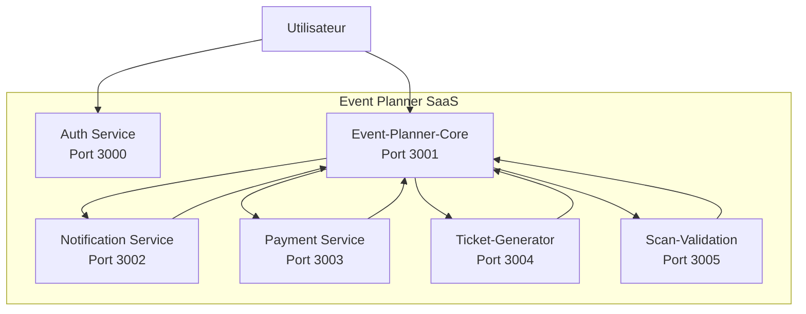
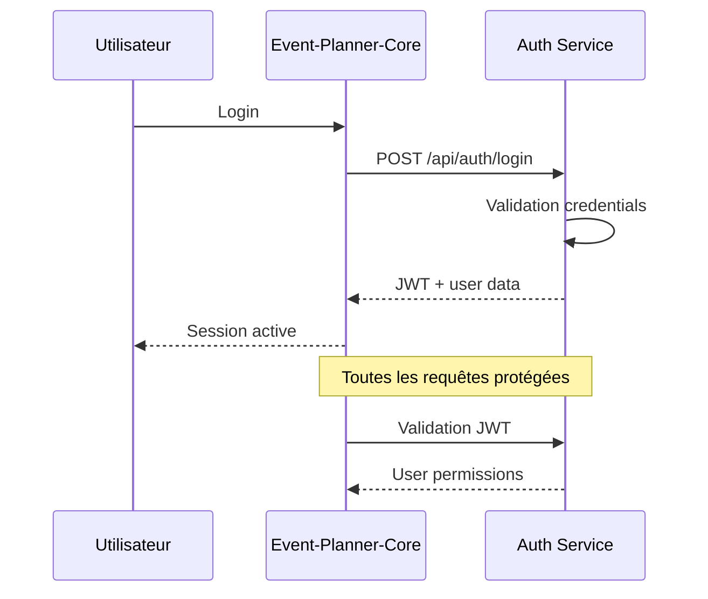
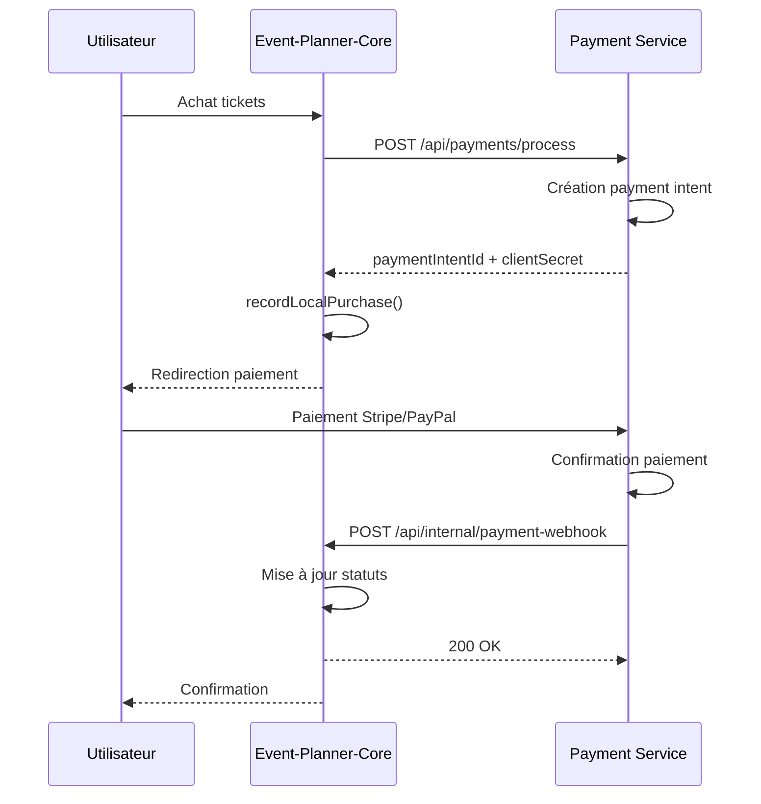
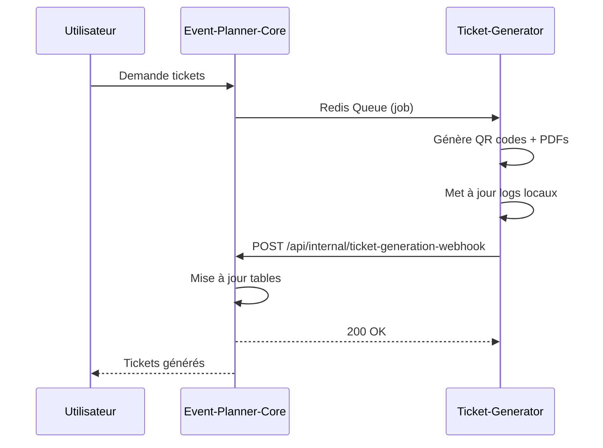
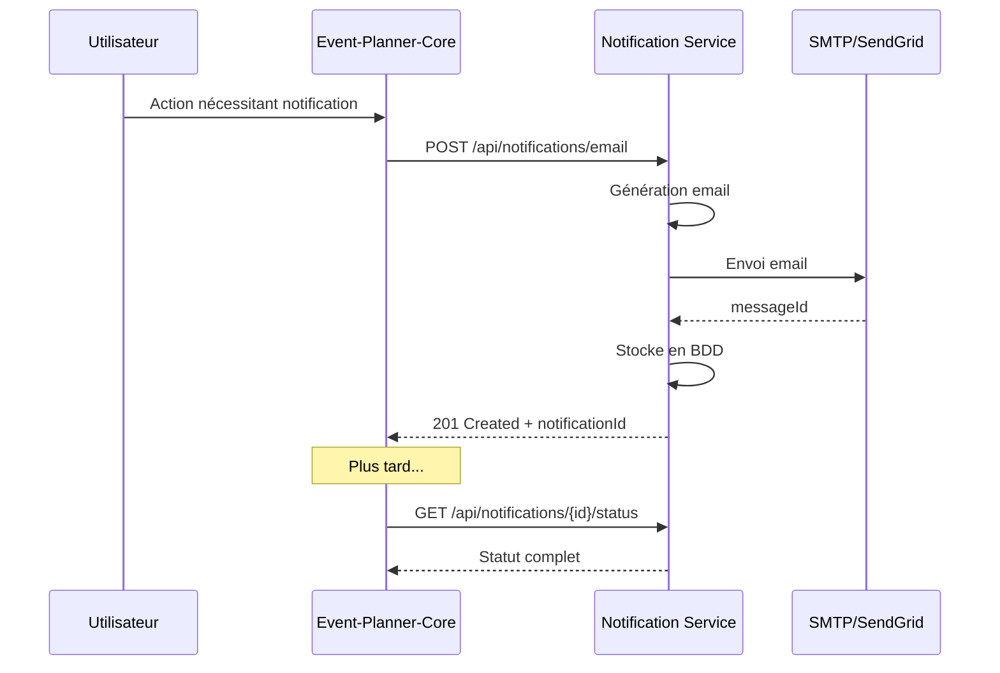
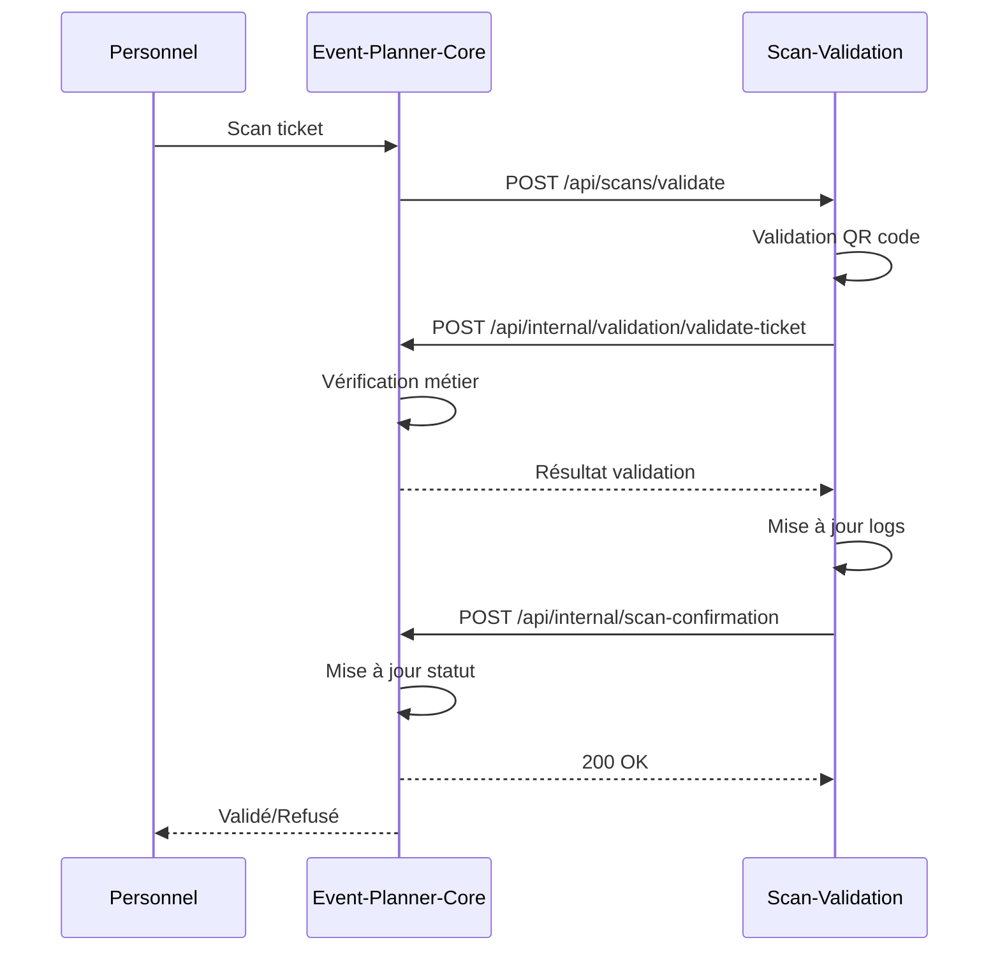

# 📋 **DOCUMENTATION COMPLÈTE DES FLOWS INTER-SERVICES**

## 🎯 **INTRODUCTION**

Ce document décrit tous les flows de communication entre les microservices de l'architecture Event Planner SaaS. Chaque flow inclut des diagrammes, le mapping des données, et les détails d'implémentation.

---

## 📊 **ARCHITECTURE GLOBALE**

### 🖼️ **DIAGRAMME VISUEL**

```
┌─────────────────────────────────────────────────────────────┐
│                    EVENT PLANNER SAAS                        │
├─────────────────────────────────────────────────────────────┤
│                                                             │
│  ┌─────────────┐    ┌─────────────────┐                    │
│  │   USER      │────│  AUTH SERVICE   │ (Port 3000)        │
│  │             │    │                 │                    │
│  └─────────────┘    └─────────────────┘                    │
│           │                   │                              │
│           │                   ▼                              │
│           │            ┌─────────────────┐                    │
│           └───────────│ EVENT-PLANNER-  │ (Port 3001)        │
│                        │     CORE        │                    │
│                        └─────────────────┘                    │
│                                   │                          │
│                    ┌──────────────┼──────────────┐           │
│                    ▼              ▼              ▼           │
│        ┌─────────────────┐ ┌─────────────────┐ ┌───────────┐ │
│        │ NOTIFICATION     │ │  PAYMENT        │ │TICKET-GEN │ │
│        │ SERVICE          │ │  SERVICE        │ │  SERVICE   │ │
│        │ (Port 3002)      │ │ (Port 3003)     │ │(Port 3004)│ │
│        └─────────────────┘ └─────────────────┘ └───────────┘ │
│                                   ▲                          │
│                    ┌──────────────┼──────────────┐           │
│                    │              │              │           │
│                    ▼              ▼              ▼           │
│        ┌─────────────────┐ ┌─────────────────┐ ┌───────────┐ │
│        │ SCAN-VALIDATION  │ │   SMTP/SendGrid │ │  QR/PDF   │ │
│        │ SERVICE          │ │   PROVIDERS     │ │ GENERATOR │ │
│        │ (Port 3005)      │ │                 │ │           │ │
│        └─────────────────┘ └─────────────────┘ └───────────┘ │
│                                                             │
└─────────────────────────────────────────────────────────────┘
```

### 🔄 **FLOW DE DONNÉES**

```
Utilisateur
    │
    ├──► Auth Service (Login/Permissions)
    │
    └──► Event-Planner-Core (Business Logic)
            │
            ├──► Notification Service ──► SMTP/SendGrid
            │
            ├──► Payment Service ────────► Stripe/PayPal
            │
            ├──► Ticket-Generator ───────► QR/PDF Files
            │
            └──► Scan-Validation ─────────► Fraud Detection
            
            ▲
            │
            └──► Webhooks de confirmation
```

### 📋 **MERMAID VERSION (pour IDE compatibles)**



---

## 🔄 **FLOW 1 : EVENT-PLANNER-CORE ↔ AUTHENTICATION SERVICE**

### 📋 **DESCRIPTION**
Gestion de l'authentification, autorisation, et sessions utilisateur.

### �️ **FLOW VISUEL**

```
┌─────────────┐    ┌─────────────────┐    ┌─────────────────┐
│   UTILISA-  │    │ EVENT-PLANNER-  │    │   AUTH SERVICE  │
│    TEUR     │    │     CORE        │    │                 │
│             │    │                 │    │                 │
│ 1. Login    │───►│ 2. Forward      │───►│ 3. Validate     │
│             │    │    request      │    │   credentials   │
│             │    │                 │    │                 │
│             │◄───│ 5. Session      │◄───│ 4. JWT + User   │
│ 6. Active   │    │    active       │    │     data         │
│             │    │                 │    │                 │
└─────────────┘    └─────────────────┘    └─────────────────┘
                                    │
                                    ▼
                           ┌─────────────────┐
                           │   REQUÊTES      │
                           │   PROTÉGÉES     │
                           │                 │
                           │ 7. Validation    │
                           │    JWT          │
                           │                 │
                           └─────────────────┘
```

### � **FLOW DÉTAILLÉ**

```
1. UTILISATEUR ──► Login credentials
2. EVENT-PLANNER-CORE ──► POST /api/auth/login
3. AUTH SERVICE ──► Validation email/password
4. AUTH SERVICE ──► JWT token + user permissions
5. EVENT-PLANNER-CORE ──► Session active pour utilisateur
6. UTILISATEUR ──► Accès autorisé

Pour chaque requête protégée :
7. EVENT-PLANNER-CORE ──► Validation JWT
8. AUTH SERVICE ──► Permissions utilisateur
```

### 📋 **MERMAID VERSION (pour IDE compatibles)**



### 📋 **MAPPING DES DONNÉES**

#### **Event-Planner-Core → Auth Service**
```javascript
// Login request
{
  "email": "user@example.com",
  "password": "hashed_password",
  "rememberMe": true
}

// Validation request
{
  "token": "jwt_token",
  "permissions": ["events:read", "tickets:create"]
}
```

#### **Auth Service → Event-Planner-Core**
```javascript
// Login response
{
  "success": true,
  "data": {
    "user": {
      "id": 123,
      "email": "user@example.com",
      "role": "organizer",
      "permissions": ["events:read", "tickets:create"]
    },
    "token": "jwt_token",
    "expiresIn": 3600
  }
}

// Validation response
{
  "valid": true,
  "userId": 123,
  "permissions": ["events:read", "tickets:create"],
  "expiresAt": "2026-01-30T03:00:00Z"
}
```

---

## 💳 **FLOW 2 : EVENT-PLANNER-CORE ↔ PAYMENT SERVICE**

### 📋 **DESCRIPTION**
Gestion des paiements, refunds, et abonnements avec Stripe/PayPal.

### 🖼️ **FLOW VISUEL**

```
┌─────────────┐    ┌─────────────────┐    ┌─────────────────┐    ┌─────────────────┐
│   UTILISA-  │    │ EVENT-PLANNER-  │    │  PAYMENT        │    │  STRIPE/PAYPAL │
│    TEUR     │    │     CORE        │    │  SERVICE        │    │   PROVIDERS    │
│             │    │                 │    │                 │    │                 │
│ 1. Achat    │───►│ 2. Process      │───►│ 3. Create       │───►│ 4. Payment      │
│    tickets  │    │    payment       │    │   intent        │    │   intent        │
│             │    │                 │    │                 │    │                 │
│             │◄───│ 6. Redirect     │◄───│ 5. Intent ID    │◄───│                 │
│ 7. Paiement │    │    paiement      │    │   + Secret      │    │                 │
│   Stripe/   │    │                 │    │                 │    │                 │
│   PayPal    │    │                 │    │                 │    │                 │
│             │    │                 │    │                 │    │                 │
│             │    │                 │    │                 │    │                 │
│             │    │                 │    │◄───│ 8. Confirm     │◄───│ 9. Payment      │
│             │    │                 │    │    payment       │    │   completed     │
│             │    │                 │    │                 │    │                 │
│             │    │◄───│11. Webhook       │◄───│10. Send         │
│12. Confirm  │    │    confirmation   │    │   webhook       │    │                 │
│             │    │                 │    │                 │    │                 │
└─────────────┘    └─────────────────┘    └─────────────────┘    └─────────────────┘
```

### 🔄 **FLOW DÉTAILLÉ**

```
1. UTILISATEUR ──► Demande achat tickets
2. EVENT-PLANNER-CORE ──► POST /api/payments/process
3. PAYMENT SERVICE ──► Création payment intent
4. STRIPE/PAYPAL ──► Génération payment intent
5. PAYMENT SERVICE ──► paymentIntentId + clientSecret
6. EVENT-PLANNER-CORE ──► Redirection utilisateur
7. UTILISATEUR ──► Paiement sur Stripe/PayPal
8. STRIPE/PAYPAL ──► Confirmation paiement
9. PAYMENT SERVICE ──► Paiement confirmé
10. PAYMENT SERVICE ──► POST /api/internal/payment-webhook
11. EVENT-PLANNER-CORE ──► Mise à jour statuts
12. UTILISATEUR ──► Confirmation finale
```

### 📋 **MERMAID VERSION (pour IDE compatibles)**



### 📋 **MAPPING DES DONNÉES**

#### **Event-Planner-Core → Payment Service**
```javascript
// Payment processing request
{
  "amount": 99.99,
  "currency": "EUR",
  "description": "Event tickets purchase",
  "customerEmail": "user@example.com",
  "customerName": "John Doe",
  "returnUrl": "https://app.eventplanner.com/payment/return",
  "preferredGateways": ["stripe"],
  "metadata": {
    "eventId": 456,
    "ticketIds": [789, 790],
    "source": "event-planner-core"
  }
}
```

#### **Payment Service → Event-Planner-Core (Webhook)**
```javascript
// Payment webhook
{
  "eventType": "payment.completed",
  "paymentIntentId": "pi_1234567890",
  "status": "completed",
  "timestamp": "2026-01-30T03:00:00Z",
  "data": {
    "payment_service_id": "pay_1234567890",
    "gateway": "stripe",
    "amount": 99.99,
    "currency": "EUR",
    "completed_at": "2026-01-30T03:00:00Z"
  }
}
```

---

## 🎫 **FLOW 3 : EVENT-PLANNER-CORE ↔ TICKET-GENERATOR SERVICE**

### 📋 **DESCRIPTION**
Génération de QR codes, PDF tickets, et fichiers d'événements.

### �️ **FLOW VISUEL**

```
┌─────────────┐    ┌─────────────────┐    ┌─────────────────┐    ┌─────────────────┐
│   UTILISA-  │    │ EVENT-PLANNER-  │    │ TICKET-GENERATOR│    │   QR/PDF FILES  │
│    TEUR     │    │     CORE        │    │    SERVICE      │    │   STORAGE      │
│             │    │                 │    │                 │    │                 │
│ 1. Demande  │───►│ 2. Create       │───►│ 3. Redis Queue  │───►│ 4. Generate     │
│   tickets   │    │    generation    │    │   job           │    │   QR + PDF      │
│             │    │    job          │    │                 │    │                 │
│             │    │                 │    │                 │    │                 │
│             │    │                 │    │◄───│ 5. Files        │◄───│ 6. Store        │
│             │    │                 │    │   generated      │    │   files         │
│             │    │                 │    │                 │    │                 │
│             │    │                 │    │                 │    │                 │
│             │    │◄───│ 8. Webhook       │◄───│ 7. Update       │
│ 9. Tickets  │    │    confirmation   │    │   logs          │
│   générés   │    │                 │    │                 │
│             │    │                 │    │                 │
└─────────────┘    └─────────────────┘    └─────────────────┘    └─────────────────┘
```

### � **FLOW DÉTAILLÉ**

```
1. UTILISATEUR ──► Demande génération tickets
2. EVENT-PLANNER-CORE ──► Création job génération
3. TICKET-GENERATOR ──► Redis Queue (job)
4. QR/PDF STORAGE ──► Génération QR codes + PDFs
5. QR/PDF STORAGE ──► Fichiers générés
6. TICKET-GENERATOR ──► Stockage fichiers
7. TICKET-GENERATOR ──► Mise à jour logs locaux
8. EVENT-PLANNER-CORE ──► POST /api/internal/ticket-generation-webhook
9. UTILISATEUR ──► Tickets générés disponibles
```

### 📋 **MERMAID VERSION (pour IDE compatibles)**



### 📋 **MAPPING DES DONNÉES**

#### **Event-Planner-Core → Ticket-Generator (Redis Queue)**
```javascript
// Generation job
{
  "job_id": "uuid-123",
  "event_id": 456,
  "tickets": [
    {
      "ticket_id": 789,
      "ticket_code": "TKT-001",
      "guest_name": "John Doe",
      "type": "standard",
      "template_id": 12
    }
  ],
  "template_data": {
    "event_title": "Tech Conference 2026",
    "event_date": "2026-06-15T09:00:00Z"
  }
}
```

#### **Ticket-Generator → Event-Planner-Core (Webhook)**
```javascript
// Generation webhook
{
  "eventType": "ticket.completed",
  "jobId": 123,
  "status": "completed",
  "timestamp": "2026-01-30T03:00:00Z",
  "data": {
    "tickets": [
      {
        "ticketId": 789,
        "ticketCode": "TKT-001",
        "qrCodeData": "base64_qr_data",
        "fileUrl": "https://cdn.eventplanner.com/tickets/789.pdf",
        "filePath": "/tickets/2026/01/30/789.pdf",
        "generatedAt": "2026-01-30T03:00:00Z",
        "success": true
      }
    ],
    "summary": {
      "total": 10,
      "successful": 8,
      "failed": 2,
      "processingTime": 1500
    }
  }
}
```

---

## 📧 **FLOW 4 : EVENT-PLANNER-CORE ↔ NOTIFICATION SERVICE**

### 📋 **DESCRIPTION**
Envoi d'emails transactionnels, SMS, et notifications de masse.

### 🖼️ **FLOW VISUEL**

```
┌─────────────┐    ┌─────────────────┐    ┌─────────────────┐    ┌─────────────────┐
│   UTILISA-  │    │ EVENT-PLANNER-  │    │ NOTIFICATION     │    │  SMTP/SENDGRID  │
│    TEUR     │    │     CORE        │    │    SERVICE      │    │   PROVIDERS    │
│             │    │                 │    │                 │    │                 │
│ 1. Action   │───►│ 2. Send         │───►│ 3. Generate     │───►│ 4. Send         │
│   trigger   │    │   notification   │    │    email         │    │   email         │
│             │    │                 │    │                 │    │                 │
│             │    │◄───│ 6. Notification  │◄───│ 5. Message ID    │◄───│                 │
│ 7. Confirm  │    │    ID + status    │    │   + status      │    │                 │
│             │    │                 │    │                 │    │                 │
│             │    │                 │    │                 │    │                 │
│             │    │    ┌─────────────┐│    │                 │    │                 │
│             │    │    │ CONSULTATION ││    │                 │    │                 │
│             │    │    │ STATUT      ││    │                 │    │                 │
│             │    │    └─────────────┘│    │                 │    │                 │
│             │    │           ▲       │    │                 │    │                 │
│             │    │           │       │    │                 │    │                 │
│             │    │    8. GET │       │    │                 │    │                 │
│             │    │   status │       │    │                 │    │                 │
│             │    │           ▼       │    │                 │    │                 │
│             │    │    9. Statut      │    │                 │    │                 │
│             │    │     complet      │    │                 │    │                 │
└─────────────┘    └─────────────────┘    └─────────────────┘    └─────────────────┘
```

### 🔄 **FLOW DÉTAILLÉ**

```
1. UTILISATEUR ──► Action nécessitant notification
2. EVENT-PLANNER-CORE ──► POST /api/notifications/email
3. NOTIFICATION SERVICE ──► Génération email avec template
4. SMTP/SENDGRID ──► Envoi email
5. SMTP/SENDGRID ──► messageId + confirmation
6. NOTIFICATION SERVICE ──► Stockage en BDD + notificationId
7. EVENT-PLANNER-CORE ──► 201 Created + notificationId

Plus tard (consultation) :
8. EVENT-PLANNER-CORE ──► GET /api/notifications/{id}/status
9. NOTIFICATION SERVICE ──► Statut complet + métadonnées
```

### 📋 **MERMAID VERSION (pour IDE compatibles)**



### 📋 **MAPPING DES DONNÉES**

#### **Event-Planner-Core → Notification Service**
```javascript
// Email sending request
{
  "to": "user@example.com",
  "template": "ticket_generated",
  "data": {
    "event_title": "Tech Conference 2026",
    "ticket_url": "https://app.eventplanner.com/tickets/789",
    "guest_name": "John Doe"
  },
  "options": {
    "priority": "high",
    "scheduledAt": "2026-01-30T03:00:00Z"
  }
}
```

#### **Notification Service → Event-Planner-Core**
```javascript
// Email sending response
{
  "success": true,
  "data": {
    "notificationId": "uuid-456",
    "messageId": "msg-1234567890",
    "status": "sent",
    "provider": "sendgrid",
    "sentAt": "2026-01-30T03:00:00Z"
  }
}

// Status check response
{
  "success": true,
  "data": {
    "notificationId": "uuid-456",
    "type": "email",
    "status": "sent",
    "recipient": "user@example.com",
    "subject": "Your tickets are ready!",
    "template": "ticket_generated",
    "provider": "sendgrid",
    "providerMessageId": "msg-1234567890",
    "createdAt": "2026-01-30T03:00:00Z",
    "sentAt": "2026-01-30T03:01:00Z",
    "eventId": 456
  }
}
```

---

## 🔍 **FLOW 5 : EVENT-PLANNER-CORE ↔ SCAN-VALIDATION SERVICE**

### 📋 **DESCRIPTION**
Validation des tickets, scan sur place, et détection de fraude.

### �️ **FLOW VISUEL**

```
┌─────────────┐    ┌─────────────────┐    ┌─────────────────┐    ┌─────────────────┐
│   PERSONNEL │    │ EVENT-PLANNER-  │    │ SCAN-VALIDATION │    │   FRAUD DETECT  │
│   ÉVÉNEMENT │    │     CORE        │    │    SERVICE      │    │     ENGINE      │
│             │    │                 │    │                 │    │                 │
│ 1. Scan     │───►│ 2. Forward      │───►│ 3. Validate     │───►│ 4. QR Code      │
│   ticket    │    │    scan         │    │    QR code      │    │   validation    │
│             │    │                 │    │                 │    │                 │
│             │    │                 │    │◄───│ 5. QR valid     │◄───│                 │
│             │    │                 │    │                 │    │                 │
│             │    │                 │    │                 │    │                 │
│             │    │◄───│ 8. Validation    │◄───│ 7. Business      │
│ 9. Validé   │    │    result        │    │    validation    │    │    check        │
│   / Refusé  │    │                 │    │                 │    │                 │
│             │    │                 │    │                 │    │                 │
│             │    │                 │    │                 │    │                 │
│             │    │◄───│11. Confirmation  │◄───│10. Update       │
│             │    │    scan          │    │    logs          │    │                 │
│             │    │                 │    │                 │    │                 │
└─────────────┘    └─────────────────┘    └─────────────────┘    └─────────────────┘
```

### �🔄 **FLOW DÉTAILLÉ**

```
1. PERSONNEL ÉVÉNEMENT ──► Scan ticket QR code
2. EVENT-PLANNER-CORE ──► POST /api/scans/validate
3. SCAN-VALIDATION SERVICE ──► Validation QR code
4. FRAUD DETECT ENGINE ──► Validation cryptographique
5. SCAN-VALIDATION SERVICE ──► QR code valide
6. SCAN-VALIDATION SERVICE ──► POST /api/internal/validation/validate-ticket
7. EVENT-PLANNER-CORE ──► Vérification métier (ticket valide, pas utilisé, etc.)
8. EVENT-PLANNER-CORE ──► Résultat validation
9. PERSONNEL ÉVÉNEMENT ──► Ticket validé/refusé
10. SCAN-VALIDATION SERVICE ──► Mise à jour logs locaux
11. EVENT-PLANNER-CORE ──► POST /api/internal/scan-confirmation
12. EVENT-PLANNER-CORE ──► Mise à jour statut ticket
```

### 📋 **MERMAID VERSION (pour IDE compatibles)**



### 📋 **MAPPING DES DONNÉES**

#### **Event-Planner-Core → Scan-Validation**
```javascript
// Validation request
{
  "qrCodeData": "encrypted_qr_data",
  "eventId": 456,
  "operatorId": 123,
  "location": "Entrée principale"
}
```

#### **Scan-Validation → Event-Planner-Core**
```javascript
// Validation result
{
  "valid": true,
  "ticketId": 789,
  "guestId": 456,
  "scanCount": 1,
  "lastScanAt": "2026-01-30T03:00:00Z"
}

// Scan confirmation
{
  "ticketId": 789,
  "scanId": "scan-123",
  "status": "validated",
  "operatorId": 123,
  "location": "Entrée principale",
  "scannedAt": "2026-01-30T03:00:00Z"
}
```

---

## 📊 **TABLES DE SYNCHRONISATION**

### **Event-Planner-Core**
| Table | Champs synchronisés | Service source |
|-------|-------------------|----------------|
| `purchases` | `payment_status`, `payment_gateway`, `payment_intent_id` | Payment Service |
| `tickets` | `qr_code_data`, `ticket_file_url`, `ticket_file_path`, `generation_job_id` | Ticket-Generator |
| `tickets` | `is_validated`, `validated_at` | Scan-Validation |

### **Payment Service**
| Table | Champs synchronisés | Service destination |
|-------|-------------------|-------------------|
| `payment_logs` | Logs techniques | Event-Planner-Core (webhook) |

### **Ticket-Generator Service**
| Table | Champs synchronisés | Service destination |
|-------|-------------------|-------------------|
| `ticket_generation_logs` | Logs webhooks | Event-Planner-Core (webhook) |
| `generated_tickets` | Fichiers générés | Event-Planner-Core (webhook) |

### **Notification Service**
| Table | Champs synchronisés | Service destination |
|-------|-------------------|-------------------|
| `notifications` | Statuts et métadonnées | Event-Planner-Core (lecture seule) |

---

## 🔧 **ENDPOINTS PRINCIPAUX**

### **Event-Planner-Core (Réception)**
```
POST /api/internal/payment-webhook          # Payment Service
POST /api/internal/ticket-generation-webhook # Ticket-Generator
POST /api/internal/validation/validate-ticket # Scan-Validation
POST /api/internal/scan-confirmation        # Scan-Validation
```

### **Event-Planner-Core (Émission)**
```
POST /api/payments/process                  # Payment Service
POST /api/tickets/generate                  # Ticket-Generator (Redis)
POST /api/notifications/email               # Notification Service
POST /api/scans/validate                    # Scan-Validation
```

### **Services Externes (Lecture)**
```
GET /api/notifications/{id}/status          # Notification Service
GET /api/notifications/history              # Notification Service
GET /api/notifications/statistics           # Notification Service
```

---

## 🛡️ **SÉCURITÉ**

### **Authentification**
- **JWT Tokens** : Authentification utilisateur
- **API Keys** : Communication inter-services
- **Webhook Secrets** : HMAC-SHA256 signatures

### **Validation**
- **Input Validation** : Joi schemas sur tous les endpoints
- **Rate Limiting** : Protection contre abus
- **CORS** : Restrictions par service

---

## 📈 **PERFORMANCE**

### **Patterns**
- **Async Processing** : Queues Redis pour gros volumes
- **Circuit Breakers** : Résilience inter-services
- **Connection Pooling** : Optimisation BDD
- **Caching** : Redis pour données fréquentes

### **Monitoring**
- **Health Checks** : `/health` sur tous services
- **Metrics** : Temps de réponse, taux d'erreur
- **Logging** : Structuré avec correlation IDs

---

## 🔄 **GESTION DES ERREURS**

### **Stratégies**
1. **Retry automatique** : Avec délais exponentiels
2. **Fallback** : Providers multiples (SMTP/SendGrid)
3. **Dead Letter Queues** : Messages en erreur
4. **Circuit Breakers** : Isolation des pannes

### **Codes d'erreur**
- **4xx** : Erreurs client (validation, authentification)
- **5xx** : Erreurs serveur (pannes, timeouts)
- **Retry-After** : Indication de retry possible

---

## 📋 **CONCLUSION**

Cette architecture microservices offre :

✅ **Scalabilité** : Chaque service indépendant  
✅ **Résilience** : Isolation des pannes  
✅ **Maintenabilité** : Séparation des responsabilités  
✅ **Sécurité** : Authentification multi-niveaux  
✅ **Performance** : Async et optimisations  

Les flows sont conçus pour être **déterministes** et **observables** avec un monitoring complet de bout en bout.
