```mermaid
sequenceDiagram
    participant User as Utilisateur
    participant Core as Event-Planner-Core
    participant Auth as Auth Service
    
    User->>Core: Login
    Core->>Auth: POST /api/auth/login
    Auth->>Auth: Validation credentials
    Auth-->>Core: JWT + user data
    Core-->>User: Session active
    
    Note over Core,Auth: Toutes les requêtes protégées
    Core->>Auth: Validation JWT
    Auth-->>Core: User permissions
```

```mermaid
sequenceDiagram
    participant User as Utilisateur
    participant Core as Event-Planner-Core
    participant Pay as Payment Service
    
    User->>Core: Achat tickets
    Core->>Pay: POST /api/payments/process
    Pay->>Pay: Création payment intent
    Pay-->>Core: paymentIntentId + clientSecret
    Core->>Core: recordLocalPurchase()
    Core-->>User: Redirection paiement
    
    User->>Pay: Paiement Stripe/PayPal
    Pay->>Pay: Confirmation paiement
    Pay->>Core: POST /api/internal/payment-webhook
    Core->>Core: Mise à jour statuts
    Core-->>Pay: 200 OK
    Core-->>User: Confirmation
```

```mermaid
sequenceDiagram
    participant User as Utilisateur
    participant Core as Event-Planner-Core
    participant Ticket as Ticket-Generator
    
    User->>Core: Demande tickets
    Core->>Ticket: Redis Queue (job)
    Ticket->>Ticket: Génère QR codes + PDFs
    Ticket->>Ticket: Met à jour logs locaux
    Ticket->>Core: POST /api/internal/ticket-generation-webhook
    Core->>Core: Mise à jour tables
    Core-->>Ticket: 200 OK
    Core-->>User: Tickets générés
```

```mermaid
sequenceDiagram
    participant User as Utilisateur
    participant Core as Event-Planner-Core
    participant Notif as Notification Service
    participant Email as SMTP/SendGrid
    
    User->>Core: Action nécessitant notification
    Core->>Notif: POST /api/notifications/email
    Notif->>Notif: Génération email
    Notif->>Email: Envoi email
    Email-->>Notif: messageId
    Notif->>Notif: Stocke en BDD
    Notif-->>Core: 201 Created + notificationId
    
    Note over Core: Plus tard...
    Core->>Notif: GET /api/notifications/{id}/status
    Notif-->>Core: Statut complet
```

```mermaid
sequenceDiagram
    participant Staff as Personnel
    participant Core as Event-Planner-Core
    participant Scan as Scan-Validation
    
    Staff->>Core: Scan ticket
    Core->>Scan: POST /api/scans/validate
    Scan->>Scan: Validation QR code
    Scan->>Core: POST /api/internal/validation/validate-ticket
    Core->>Core: Vérification métier
    Core-->>Scan: Résultat validation
    Scan->>Scan: Mise à jour logs
    Scan->>Core: POST /api/internal/scan-confirmation
    Core->>Core: Mise à jour statut
    Core-->>Scan: 200 OK
    Core-->>Staff: Validé/Refusé
```

# 📋 **DOCUMENTATION COMPLÈTE DES FLOWS INTER-SERVICES**

## 🎯 **INTRODUCTION**

Ce document décrit tous les flows de communication entre les microservices de l'architecture Event Planner SaaS. Chaque flow inclut des diagrammes, le mapping des données, et les détails d'implémentation.

---

## 📊 **ARCHITECTURE GLOBALE**


---

## 🔄 **FLOW 1 : EVENT-PLANNER-CORE ↔ AUTHENTICATION SERVICE**

### 📋 **DESCRIPTION**
Gestion de l'authentification, autorisation, et sessions utilisateur.

### 🔄 **FLOW COMPLET**


### 📋 **MAPPING DES DONNÉES**

#### **Event-Planner-Core → Auth Service**
```javascript
// Login request
{
  "email": "user@example.com",
  "password": "hashed_password",
  "rememberMe": true
}

// Validation request
{
  "token": "jwt_token",
  "permissions": ["events:read", "tickets:create"]
}
```

#### **Auth Service → Event-Planner-Core**
```javascript
// Login response
{
  "success": true,
  "data": {
    "user": {
      "id": 123,
      "email": "user@example.com",
      "role": "organizer",
      "permissions": ["events:read", "tickets:create"]
    },
    "token": "jwt_token",
    "expiresIn": 3600
  }
}

// Validation response
{
  "valid": true,
  "userId": 123,
  "permissions": ["events:read", "tickets:create"],
  "expiresAt": "2026-01-30T03:00:00Z"
}
```

---

## 💳 **FLOW 2 : EVENT-PLANNER-CORE ↔ PAYMENT SERVICE**

### 📋 **DESCRIPTION**
Gestion des paiements, refunds, et abonnements avec Stripe/PayPal.

### 🔄 **FLOW COMPLET**


### 📋 **MAPPING DES DONNÉES**

#### **Event-Planner-Core → Payment Service**
```javascript
// Payment processing request
{
  "amount": 99.99,
  "currency": "EUR",
  "description": "Event tickets purchase",
  "customerEmail": "user@example.com",
  "customerName": "John Doe",
  "returnUrl": "https://app.eventplanner.com/payment/return",
  "preferredGateways": ["stripe"],
  "metadata": {
    "eventId": 456,
    "ticketIds": [789, 790],
    "source": "event-planner-core"
  }
}
```

#### **Payment Service → Event-Planner-Core (Webhook)**
```javascript
// Payment webhook
{
  "eventType": "payment.completed",
  "paymentIntentId": "pi_1234567890",
  "status": "completed",
  "timestamp": "2026-01-30T03:00:00Z",
  "data": {
    "payment_service_id": "pay_1234567890",
    "gateway": "stripe",
    "amount": 99.99,
    "currency": "EUR",
    "completed_at": "2026-01-30T03:00:00Z"
  }
}
```

---

## 🎫 **FLOW 3 : EVENT-PLANNER-CORE ↔ TICKET-GENERATOR SERVICE**

### 📋 **DESCRIPTION**
Génération de QR codes, PDF tickets, et fichiers d'événements.

### 🔄 **FLOW COMPLET**


### 📋 **MAPPING DES DONNÉES**

#### **Event-Planner-Core → Ticket-Generator (Redis Queue)**
```javascript
// Generation job
{
  "job_id": "uuid-123",
  "event_id": 456,
  "tickets": [
    {
      "ticket_id": 789,
      "ticket_code": "TKT-001",
      "guest_name": "John Doe",
      "type": "standard",
      "template_id": 12
    }
  ],
  "template_data": {
    "event_title": "Tech Conference 2026",
    "event_date": "2026-06-15T09:00:00Z"
  }
}
```

#### **Ticket-Generator → Event-Planner-Core (Webhook)**
```javascript
// Generation webhook
{
  "eventType": "ticket.completed",
  "jobId": 123,
  "status": "completed",
  "timestamp": "2026-01-30T03:00:00Z",
  "data": {
    "tickets": [
      {
        "ticketId": 789,
        "ticketCode": "TKT-001",
        "qrCodeData": "base64_qr_data",
        "fileUrl": "https://cdn.eventplanner.com/tickets/789.pdf",
        "filePath": "/tickets/2026/01/30/789.pdf",
        "generatedAt": "2026-01-30T03:00:00Z",
        "success": true
      }
    ],
    "summary": {
      "total": 10,
      "successful": 8,
      "failed": 2,
      "processingTime": 1500
    }
  }
}
```

---

## 📧 **FLOW 4 : EVENT-PLANNER-CORE ↔ NOTIFICATION SERVICE**

### 📋 **DESCRIPTION**
Envoi d'emails transactionnels, SMS, et notifications de masse.

### 🔄 **FLOW COMPLET**


### 📋 **MAPPING DES DONNÉES**

#### **Event-Planner-Core → Notification Service**
```javascript
// Email sending request
{
  "to": "user@example.com",
  "template": "ticket_generated",
  "data": {
    "event_title": "Tech Conference 2026",
    "ticket_url": "https://app.eventplanner.com/tickets/789",
    "guest_name": "John Doe"
  },
  "options": {
    "priority": "high",
    "scheduledAt": "2026-01-30T03:00:00Z"
  }
}
```

#### **Notification Service → Event-Planner-Core**
```javascript
// Email sending response
{
  "success": true,
  "data": {
    "notificationId": "uuid-456",
    "messageId": "msg-1234567890",
    "status": "sent",
    "provider": "sendgrid",
    "sentAt": "2026-01-30T03:00:00Z"
  }
}

// Status check response
{
  "success": true,
  "data": {
    "notificationId": "uuid-456",
    "type": "email",
    "status": "sent",
    "recipient": "user@example.com",
    "subject": "Your tickets are ready!",
    "template": "ticket_generated",
    "provider": "sendgrid",
    "providerMessageId": "msg-1234567890",
    "createdAt": "2026-01-30T03:00:00Z",
    "sentAt": "2026-01-30T03:01:00Z",
    "eventId": 456
  }
}
```

---

## 🔍 **FLOW 5 : EVENT-PLANNER-CORE ↔ SCAN-VALIDATION SERVICE**

### 📋 **DESCRIPTION**
Validation des tickets, scan sur place, et détection de fraude.

### 🔄 **FLOW COMPLET**


### 📋 **MAPPING DES DONNÉES**

#### **Event-Planner-Core → Scan-Validation**
```javascript
// Validation request
{
  "qrCodeData": "encrypted_qr_data",
  "eventId": 456,
  "operatorId": 123,
  "location": "Entrée principale"
}
```

#### **Scan-Validation → Event-Planner-Core**
```javascript
// Validation result
{
  "valid": true,
  "ticketId": 789,
  "guestId": 456,
  "scanCount": 1,
  "lastScanAt": "2026-01-30T03:00:00Z"
}

// Scan confirmation
{
  "ticketId": 789,
  "scanId": "scan-123",
  "status": "validated",
  "operatorId": 123,
  "location": "Entrée principale",
  "scannedAt": "2026-01-30T03:00:00Z"
}
```

---

## 📊 **TABLES DE SYNCHRONISATION**

### **Event-Planner-Core**
| Table | Champs synchronisés | Service source |
|-------|-------------------|----------------|
| `purchases` | `payment_status`, `payment_gateway`, `payment_intent_id` | Payment Service |
| `tickets` | `qr_code_data`, `ticket_file_url`, `ticket_file_path`, `generation_job_id` | Ticket-Generator |
| `tickets` | `is_validated`, `validated_at` | Scan-Validation |

### **Payment Service**
| Table | Champs synchronisés | Service destination |
|-------|-------------------|-------------------|
| `payment_logs` | Logs techniques | Event-Planner-Core (webhook) |

### **Ticket-Generator Service**
| Table | Champs synchronisés | Service destination |
|-------|-------------------|-------------------|
| `ticket_generation_logs` | Logs webhooks | Event-Planner-Core (webhook) |
| `generated_tickets` | Fichiers générés | Event-Planner-Core (webhook) |

### **Notification Service**
| Table | Champs synchronisés | Service destination |
|-------|-------------------|-------------------|
| `notifications` | Statuts et métadonnées | Event-Planner-Core (lecture seule) |

---

## 🔧 **ENDPOINTS PRINCIPAUX**

### **Event-Planner-Core (Réception)**
```
POST /api/internal/payment-webhook          # Payment Service
POST /api/internal/ticket-generation-webhook # Ticket-Generator
POST /api/internal/validation/validate-ticket # Scan-Validation
POST /api/internal/scan-confirmation        # Scan-Validation
```

### **Event-Planner-Core (Émission)**
```
POST /api/payments/process                  # Payment Service
POST /api/tickets/generate                  # Ticket-Generator (Redis)
POST /api/notifications/email               # Notification Service
POST /api/scans/validate                    # Scan-Validation
```

### **Services Externes (Lecture)**
```
GET /api/notifications/{id}/status          # Notification Service
GET /api/notifications/history              # Notification Service
GET /api/notifications/statistics           # Notification Service
```

---

## 🛡️ **SÉCURITÉ**

### **Authentification**
- **JWT Tokens** : Authentification utilisateur
- **API Keys** : Communication inter-services
- **Webhook Secrets** : HMAC-SHA256 signatures

### **Validation**
- **Input Validation** : Joi schemas sur tous les endpoints
- **Rate Limiting** : Protection contre abus
- **CORS** : Restrictions par service

---

## 📈 **PERFORMANCE**

### **Patterns**
- **Async Processing** : Queues Redis pour gros volumes
- **Circuit Breakers** : Résilience inter-services
- **Connection Pooling** : Optimisation BDD
- **Caching** : Redis pour données fréquentes

### **Monitoring**
- **Health Checks** : `/health` sur tous services
- **Metrics** : Temps de réponse, taux d'erreur
- **Logging** : Structuré avec correlation IDs

---

## 🔄 **GESTION DES ERREURS**

### **Stratégies**
1. **Retry automatique** : Avec délais exponentiels
2. **Fallback** : Providers multiples (SMTP/SendGrid)
3. **Dead Letter Queues** : Messages en erreur
4. **Circuit Breakers** : Isolation des pannes

### **Codes d'erreur**
- **4xx** : Erreurs client (validation, authentification)
- **5xx** : Erreurs serveur (pannes, timeouts)
- **Retry-After** : Indication de retry possible

---

## 📋 **CONCLUSION**

Cette architecture microservices offre :

✅ **Scalabilité** : Chaque service indépendant  
✅ **Résilience** : Isolation des pannes  
✅ **Maintenabilité** : Séparation des responsabilités  
✅ **Sécurité** : Authentification multi-niveaux  
✅ **Performance** : Async et optimisations  

Les flows sont conçus pour être **déterministes** et **observables** avec un monitoring complet de bout en bout.
