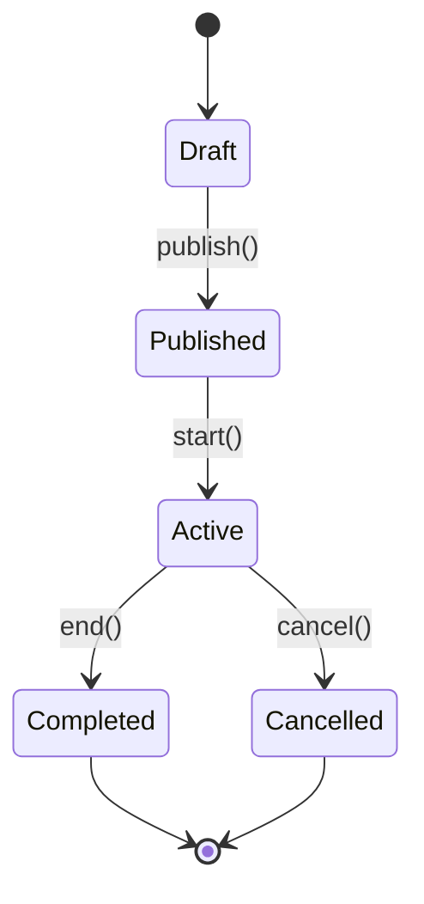
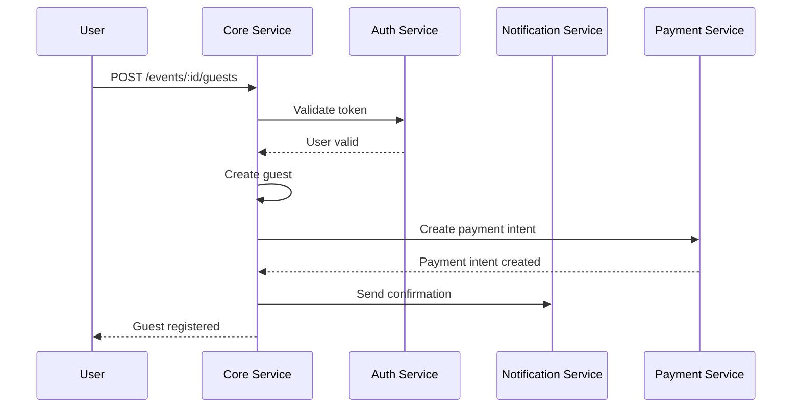

# 🎯 CORE SERVICE - DOCUMENTATION TECHNIQUE

## 🎯 Vue d'ensemble

Le **Core Service** est le cœur métier de la plateforme Event Planner SaaS. Il orchestre toutes les opérations principales : gestion des événements, invités, tickets, et coordonne les autres services.

## 🏗️ Architecture Technique

### Stack Technique
```
┌─────────────────────────────────────────┐
│             CORE SERVICE                  │
├─────────────────────────────────────────┤
│ 📦 Node.js + Express.js                  │
│ 🗄️ PostgreSQL (données métier)           │
│ 🔴 Redis (cache + queues)                │
│ 📊 Bull Queue (jobs asynchrones)         │
│ 📊 Winston (logs)                        │
│ 📊 Prometheus (métriques)                │
└─────────────────────────────────────────┘
```

### Architecture en Couches
```
┌─────────────────────────────────────────┐
│              API LAYER                   │
│  ┌─────────────┬─────────────────────────┐   │
│  │   Routes    │     Controllers        │   │
│  │  (Express)   │    (Business Logic)     │   │
│  └─────────────┴─────────────────────────┘   │
├─────────────────────────────────────────┤
│             SERVICE LAYER                 │
│  ┌─────────────┬─────────────────────────┐   │
│  │   Services   │     Repositories       │   │
│  │ (Core Logic) │   (Data Access)        │   │
│  └─────────────┴─────────────────────────┘   │
├─────────────────────────────────────────┤
│            CLIENTS LAYER                  │
│  ┌─────────────┬─────────────────────────┐   │
│  │ Auth Client  │ Notification Client    │   │
│  │ Payment Cl. │ Ticket Generator Cl.  │   │
│  └─────────────┴─────────────────────────┘   │
├─────────────────────────────────────────┤
│              DATA LAYER                   │
│  ┌─────────────┬─────────────────────────┐   │
│  │ PostgreSQL  │        Redis            │   │
│  │ (Primary)   │      (Cache/Queue)      │   │
│  └─────────────┴─────────────────────────┘   │
└─────────────────────────────────────────┘
```

## 🎪 Gestion des Événements

### 1. Cycle de Vie d'un Événement


### 2. Modèle de Données
```javascript
// Schéma Event
const EventSchema = {
  id: 'BIGSERIAL PRIMARY KEY',
  title: 'VARCHAR(255) NOT NULL',
  description: 'TEXT',
  eventDate: 'TIMESTAMP WITH TIME ZONE NOT NULL',
  location: 'VARCHAR(500) NOT NULL',
  maxAttendees: 'INTEGER NOT NULL',
  currentAttendees: 'INTEGER DEFAULT 0',
  organizerId: 'BIGINT NOT NULL',
  status: 'VARCHAR(20) DEFAULT \'draft\'',
  createdAt: 'TIMESTAMP WITH TIME ZONE DEFAULT NOW()',
  updatedAt: 'TIMESTAMP WITH TIME ZONE DEFAULT NOW()',
  deletedAt: 'TIMESTAMP WITH TIME ZONE' // Soft delete
};
```

### 3. Validation des Données
```javascript
const eventValidationSchema = Joi.object({
  title: Joi.string().min(3).max(255).required(),
  description: Joi.string().max(2000),
  eventDate: Joi.date().iso().min('now').required(),
  location: Joi.string().min(3).max(500).required(),
  maxAttendees: Joi.number().integer().min(1).max(100000).required(),
  ticketTypes: Joi.array().items(
    Joi.object({
      name: Joi.string().min(1).max(100).required(),
      price: Joi.number().min(0).precision(2).required(),
      quantity: Joi.number().integer().min(1).required(),
      description: Joi.string().max(500)
    })
  ).min(1).required()
});
```

## 👥 Gestion des Invités

### 1. Processus d'Inscription


### 2. Types d'Invités
```javascript
const GuestTypes = {
  REGULAR: 'regular',        // Inscription normale
  VIP: 'vip',                // Invité VIP
  SPEAKER: 'speaker',        // Orateur
  STAFF: 'staff',            // Personnel
  PRESS: 'press',            // Presse
  SPONSOR: 'sponsor'          // Sponsor
};
```

### 3. Statuts des Invités
```javascript
const GuestStatus = {
  REGISTERED: 'registered',  // Inscrit
  CONFIRMED: 'confirmed',    // Confirmé
  PENDING: 'pending',        // En attente
  CANCELLED: 'cancelled',    // Annulé
  CHECKED_IN: 'checked_in'   // Présent
};
```

## 🎫 Gestion des Tickets

### 1. Génération de Tickets
```javascript
class TicketGenerator {
  async generateTicket(guestId, eventId, ticketType) {
    // 1. Générer un code unique
    const ticketCode = this.generateUniqueCode();
    
    // 2. Créer le ticket en base
    const ticket = await this.ticketRepository.create({
      guestId,
      eventId,
      ticketCode,
      ticketType,
      status: 'generated'
    });
    
    // 3. Mettre en file d'attente pour génération QR/PDF
    await this.queueService.add('generate-ticket-pdf', {
      ticketId: ticket.id,
      ticketCode,
      guestData: await this.getGuestData(guestId),
      eventData: await this.getEventData(eventId)
    });
    
    return ticket;
  }
  
  generateUniqueCode() {
    const prefix = 'EVT';
    const timestamp = Date.now().toString(36);
    const random = Math.random().toString(36).substr(2, 5);
    return `${prefix}-${timestamp}-${random}`.toUpperCase();
  }
}
```

### 2. QR Codes Sécurisés
```javascript
class QRCodeGenerator {
  generateSecureQRCode(ticketData) {
    const payload = {
      ticketId: ticketData.id,
      eventId: ticketData.eventId,
      guestId: ticketData.guestId,
      timestamp: Date.now(),
      signature: this.generateSignature(ticketData)
    };
    
    return qrcode.toDataURL(JSON.stringify(payload));
  }
  
  generateSignature(data) {
    const crypto = require('crypto');
    const secret = process.env.QR_SIGNATURE_SECRET;
    return crypto
      .createHmac('sha256', secret)
      .update(JSON.stringify(data))
      .digest('hex');
  }
}
```

## 🔄 Communication Inter-Services

### 1. Pattern Client HTTP
```javascript
class ServiceClient {
  constructor(serviceName) {
    this.serviceName = serviceName;
    this.baseURL = process.env[`${serviceName.toUpperCase()}_SERVICE_URL`];
    this.timeout = 30000;
    this.retries = 3;
  }
  
  async request(method, endpoint, data = {}) {
    try {
      const response = await axios({
        method,
        url: `${this.baseURL}${endpoint}`,
        data,
        timeout: this.timeout,
        headers: {
          'Content-Type': 'application/json',
          'X-Service-Token': process.env.SHARED_SERVICE_TOKEN,
          'Authorization': `Bearer ${this.getAuthToken()}`
        }
      });
      
      return response.data;
    } catch (error) {
      if (this.retries > 0) {
        await this.delay(1000);
        this.retries--;
        return this.request(method, endpoint, data);
      }
      throw error;
    }
  }
}
```

### 2. Communication Asynchrone
```javascript
// Queue Service
class QueueService {
  constructor() {
    this.emailQueue = new Bull('email-processing', {
      redis: {
        host: process.env.REDIS_QUEUE_HOST,
        port: process.env.REDIS_QUEUE_PORT
      }
    });
  }
  
  async sendEmailNotification(data) {
    await this.emailQueue.add('send-email', data, {
      attempts: 3,
      backoff: 'exponential',
      delay: 0
    });
  }
}

// Worker
emailQueue.process('send-email', async (job) => {
  const { to, subject, template, data } = job.data;
  
  try {
    const notificationClient = new NotificationClient();
    await notificationClient.sendEmail({ to, subject, template, data });
    
    logger.info('Email sent successfully', {
      jobId: job.id,
      to,
      template
    });
    
    return { success: true };
  } catch (error) {
    logger.error('Failed to send email', {
      jobId: job.id,
      error: error.message,
      to
    });
    
    throw error;
  }
});
```

## 📊 Statistiques et Analytics

### 1. Agrégation en Temps Réel
```javascript
class StatisticsService {
  async getEventStatistics(eventId, period = '24h') {
    const cacheKey = `stats:event:${eventId}:${period}`;
    
    // Vérifier le cache
    const cached = await this.cache.get(cacheKey);
    if (cached) {
      return JSON.parse(cached);
    }
    
    // Agrégerer les données
    const stats = await this.aggregateEventStats(eventId, period);
    
    // Mettre en cache pour 5 minutes
    await this.cache.set(cacheKey, JSON.stringify(stats), 300);
    
    return stats;
  }
  
  async aggregateEventStats(eventId, period) {
    const timeRange = this.getTimeRange(period);
    
    const [
      totalGuests,
      confirmedGuests,
      checkedInGuests,
      ticketStats,
      revenueStats
    ] = await Promise.all([
      this.guestRepository.countByEvent(eventId, timeRange),
      this.guestRepository.countByStatus(eventId, 'confirmed', timeRange),
      this.ticketRepository.countCheckedIn(eventId, timeRange),
      this.ticketRepository.getTicketTypeStats(eventId, timeRange),
      this.paymentRepository.getRevenueStats(eventId, timeRange)
    ]);
    
    return {
      eventId,
      period,
      totalGuests,
      confirmedGuests,
      checkedInGuests,
      checkInRate: totalGuests > 0 ? checkedInGuests / totalGuests : 0,
      ticketStats,
      revenueStats,
      generatedAt: new Date()
    };
  }
}
```

### 2. Métriques Prometheus
```javascript
const promClient = require('prom-client');

// Compteurs
const eventCreatedCounter = new promClient.Counter({
  name: 'events_created_total',
  help: 'Total number of events created',
  labelNames: ['organizer_id', 'status']
});

const guestRegisteredCounter = new promClient.Counter({
  name: 'guests_registered_total',
  help: 'Total number of guests registered',
  labelNames: ['event_id', 'ticket_type']
});

// Histogrammes
const eventCreationDuration = new promClient.Histogram({
  name: 'event_creation_duration_seconds',
  help: 'Time taken to create events',
  buckets: [0.1, 0.5, 1, 2, 5, 10]
});

// Jauges
const activeEventsGauge = new promClient.Gauge({
  name: 'active_events_count',
  help: 'Number of currently active events'
});
```

## 🗄️ Base de Données

### 1. Schéma Principal
```sql
-- Événements
CREATE TABLE events (
    id BIGSERIAL PRIMARY KEY,
    title VARCHAR(255) NOT NULL,
    description TEXT,
    event_date TIMESTAMP WITH TIME ZONE NOT NULL,
    location VARCHAR(500) NOT NULL,
    max_attendees INTEGER NOT NULL,
    current_attendees INTEGER DEFAULT 0,
    organizer_id BIGINT NOT NULL,
    status VARCHAR(20) DEFAULT 'draft',
    created_at TIMESTAMP WITH TIME ZONE DEFAULT NOW(),
    updated_at TIMESTAMP WITH TIME ZONE DEFAULT NOW(),
    deleted_at TIMESTAMP WITH TIME ZONE, -- Soft delete
    CONSTRAINT fk_events_organizer FOREIGN KEY (organizer_id) REFERENCES users(id)
);

-- Invités
CREATE TABLE guests (
    id BIGSERIAL PRIMARY KEY,
    event_id BIGINT NOT NULL,
    first_name VARCHAR(100) NOT NULL,
    last_name VARCHAR(100) NOT NULL,
    email VARCHAR(255) NOT NULL,
    phone VARCHAR(20),
    ticket_type_id BIGINT,
    status VARCHAR(20) DEFAULT 'registered',
    created_at TIMESTAMP WITH TIME ZONE DEFAULT NOW(),
    updated_at TIMESTAMP WITH TIME ZONE DEFAULT NOW(),
    deleted_at TIMESTAMP WITH TIME ZONE, -- Soft delete
    CONSTRAINT fk_guests_event FOREIGN KEY (event_id) REFERENCES events(id),
    CONSTRAINT uq_guests_email_event UNIQUE (email, event_id)
);

-- Types de tickets
CREATE TABLE ticket_types (
    id BIGSERIAL PRIMARY KEY,
    event_id BIGINT NOT NULL,
    name VARCHAR(100) NOT NULL,
    price DECIMAL(10,2) NOT NULL,
    quantity INTEGER NOT NULL,
    description TEXT,
    created_at TIMESTAMP WITH TIME ZONE DEFAULT NOW(),
    updated_at TIMESTAMP WITH TIME ZONE DEFAULT NOW(),
    CONSTRAINT fk_ticket_types_event FOREIGN KEY (event_id) REFERENCES events(id)
);

-- Tickets
CREATE TABLE tickets (
    id BIGSERIAL PRIMARY KEY,
    guest_id BIGINT NOT NULL,
    ticket_type_id BIGINT NOT NULL,
    ticket_code VARCHAR(50) UNIQUE NOT NULL,
    qr_code_data TEXT,
    is_validated BOOLEAN DEFAULT false,
    validated_at TIMESTAMP WITH TIME ZONE,
    created_at TIMESTAMP WITH TIME ZONE DEFAULT NOW(),
    updated_at TIMESTAMP WITH TIME ZONE DEFAULT NOW(),
    CONSTRAINT fk_tickets_guest FOREIGN KEY (guest_id) REFERENCES guests(id),
    CONSTRAINT fk_tickets_type FOREIGN KEY (ticket_type_id) REFERENCES ticket_types(id)
);
```

### 2. Index de Performance
```sql
-- Index pour les recherches rapides
CREATE INDEX idx_events_status ON events(status);
CREATE INDEX idx_events_date ON events(event_date);
CREATE INDEX idx_events_organizer ON events(organizer_id);
CREATE INDEX idx_events_status_date ON events(status, event_date);

CREATE INDEX idx_guests_event ON guests(event_id);
CREATE INDEX idx_guests_email ON guests(email);
CREATE INDEX idx_guests_status ON guests(status);
CREATE INDEX idx_guests_event_status ON guests(event_id, status);

CREATE INDEX idx_tickets_code ON tickets(ticket_code);
CREATE INDEX idx_tickets_guest ON tickets(guest_id);
CREATE INDEX idx_tickets_validated ON tickets(is_validated);
CREATE INDEX idx_tickets_validated_at ON tickets(validated_at);

-- Index composites pour les requêtes complexes
CREATE INDEX idx_events_organizer_status ON events(organizer_id, status);
CREATE INDEX idx_guests_event_status_date ON guests(event_id, status, created_at);
```

## 🚀 Performance

### 1. Optimisations
```javascript
// Connection Pooling
const pool = new Pool({
  host: process.env.DB_HOST,
  port: process.env.DB_PORT,
  database: process.env.DB_NAME,
  user: process.env.DB_USER,
  password: process.env.DB_PASSWORD,
  max: 20,        // Maximum connections
  min: 2,         // Minimum connections
  idleTimeoutMillis: 30000,
  connectionTimeoutMillis: 2000,
});

// Query Builder avec pagination
class EventRepository {
  async findEvents(options = {}) {
    const {
      page = 1,
      limit = 20,
      status,
      organizerId,
      search,
      dateFrom,
      dateTo
    } = options;
    
    let query = `
      SELECT e.*, u.first_name || ' ' || u.last_name as organizer_name,
             COUNT(g.id) as guest_count
      FROM events e
      JOIN users u ON e.organizer_id = u.id
      LEFT JOIN guests g ON e.id = g.event_id AND g.deleted_at IS NULL
      WHERE e.deleted_at IS NULL
    `;
    
    const params = [];
    const conditions = [];
    
    if (status) {
      conditions.push(`e.status = $${params.length + 1}`);
      params.push(status);
    }
    
    if (organizerId) {
      conditions.push(`e.organizer_id = $${params.length + 1}`);
      params.push(organizerId);
    }
    
    if (search) {
      conditions.push(`(e.title ILIKE $${params.length + 1} OR e.description ILIKE $${params.length + 1})`);
      params.push(`%${search}%`);
    }
    
    if (conditions.length > 0) {
      query += ` AND ${conditions.join(' AND ')}`;
    }
    
    query += ` GROUP BY e.id, u.first_name, u.last_name`;
    query += ` ORDER BY e.created_at DESC`;
    query += ` LIMIT $${params.length + 1} OFFSET $${params.length + 2}`;
    params.push(limit, (page - 1) * limit);
    
    const result = await pool.query(query, params);
    return result.rows;
  }
}
```

### 2. Cache Strategy
```javascript
class CacheService {
  constructor() {
    this.client = redis.createClient();
  }
  
  async get(key) {
    try {
      const data = await this.client.get(key);
      return data ? JSON.parse(data) : null;
    } catch (error) {
      logger.error('Cache get error', { key, error: error.message });
      return null;
    }
  }
  
  async set(key, data, ttl = 3600) {
    try {
      await this.client.setex(key, ttl, JSON.stringify(data));
    } catch (error) {
      logger.error('Cache set error', { key, error: error.message });
    }
  }
  
  async invalidatePattern(pattern) {
    try {
      const keys = await this.client.keys(pattern);
      if (keys.length > 0) {
        await this.client.del(keys);
      }
    } catch (error) {
      logger.error('Cache invalidate error', { pattern, error: error.message });
    }
  }
}
```

## 📊 Monitoring

### 1. Health Checks
```javascript
class HealthService {
  async getHealthStatus() {
    const checks = await Promise.allSettled([
      this.checkDatabase(),
      this.checkRedis(),
      this.checkAuth(),
      this.checkNotification(),
      this.checkPayment()
    ]);
    
    const status = {
      status: 'healthy',
      timestamp: new Date(),
      service: 'core-service',
      version: process.env.npm_package_version,
      uptime: process.uptime(),
      checks: {}
    };
    
    let hasError = false;
    
    checks.forEach((check, index) => {
      const name = ['database', 'redis', 'auth', 'notification', 'payment'][index];
      
      if (check.status === 'fulfilled') {
        status.checks[name] = {
          status: 'healthy',
          responseTime: check.value.responseTime,
          details: check.value.details
        };
      } else {
        status.checks[name] = {
          status: 'unhealthy',
          error: check.reason.message
        };
        hasError = true;
      }
    });
    
    if (hasError) {
      status.status = 'degraded';
    }
    
    return status;
  }
}
```

### 2. Logs Structurés
```javascript
// Middleware de logging
const requestLogger = (req, res, next) => {
  const start = Date.now();
  
  res.on('finish', () => {
    const duration = Date.now() - start;
    
    logger.info('HTTP Request', {
      method: req.method,
      url: req.url,
      statusCode: res.statusCode,
      duration,
      userAgent: req.get('User-Agent'),
      ip: req.ip,
      userId: req.user?.id,
      requestId: req.id
    });
  });
  
  next();
};
```

## 🧪 Tests

### 1. Tests d'Intégration
```javascript
describe('Event Integration Tests', () => {
  let authToken;
  let testEvent;
  
  beforeAll(async () => {
    // Créer un utilisateur et obtenir un token
    const user = await createTestUser();
    authToken = await getAuthToken(user);
  });
  
  test('should create event with tickets', async () => {
    const eventData = {
      title: 'Test Event',
      description: 'Test Description',
      eventDate: new Date(Date.now() + 7 * 24 * 60 * 60 * 1000),
      location: 'Test Location',
      maxAttendees: 100,
      ticketTypes: [
        {
          name: 'Standard',
          price: 50,
          quantity: 80
        },
        {
          name: 'VIP',
          price: 100,
          quantity: 20
        }
      ]
    };
    
    const response = await request(app)
      .post('/api/events')
      .set('Authorization', `Bearer ${authToken}`)
      .send(eventData)
      .expect(201);
    
    testEvent = response.body.data;
    expect(testEvent.title).toBe(eventData.title);
    expect(testEvent.ticketTypes).toHaveLength(2);
  });
  
  test('should register guest for event', async () => {
    const guestData = {
      firstName: 'John',
      lastName: 'Doe',
      email: 'john.doe@example.com',
      phone: '+33612345678',
      ticketTypeId: testEvent.ticketTypes[0].id
    };
    
    const response = await request(app)
      .post(`/api/events/${testEvent.id}/guests`)
      .set('Authorization', `Bearer ${authToken}`)
      .send(guestData)
      .expect(201);
    
    expect(response.body.data.firstName).toBe(guestData.firstName);
    expect(response.body.data.email).toBe(guestData.email);
  });
});
```

## 🚀 Scalabilité

### 1. Horizontal Scaling
```yaml
# Kubernetes HPA
apiVersion: autoscaling/v2
kind: HorizontalPodAutoscaler
metadata:
  name: core-service-hpa
spec:
  scaleTargetRef:
    apiVersion: apps/v1
    kind: Deployment
    name: core-service
  minReplicas: 3
  maxReplicas: 20
  metrics:
  - type: Resource
    resource:
      name: cpu
      target:
        type: Utilization
        averageUtilization: 70
  - type: Resource
    resource:
      name: memory
      target:
        type: Utilization
        averageUtilization: 80
```

### 2. Database Scaling
```sql
-- Read Replicas
CREATE DATABASE event_planner_core_replica;

-- Configuration PostgreSQL
-- postgresql.conf
max_connections = 200
shared_buffers = 256MB
effective_cache_size = 1GB
work_mem = 4MB
maintenance_work_mem = 64MB
```

## 🔧 Configuration

### Variables d'Environnement Clés
```bash
# Service
PORT=3001
NODE_ENV=production

# Base de données
DB_HOST=localhost
DB_NAME=event_planner_core
DB_POOL_MIN=2
DB_POOL_MAX=10

# Cache
REDIS_HOST=localhost
REDIS_DB=1
CACHE_TTL=3600

# Communication
AUTH_SERVICE_URL=http://localhost:3000
NOTIFICATION_SERVICE_URL=http://localhost:3002
PAYMENT_SERVICE_URL=http://localhost:3003

# JWT
JWT_SECRET=your_256_bit_secret
SHARED_SERVICE_TOKEN=shared-service-token

# Performance
ENABLE_METRICS=true
METRICS_PORT=9091
```

## 📈 Vision Future

### 1. Évolutions Prévues
- **AI/ML** : Recommandation d'événements
- **Real-time** : WebSocket pour les mises à jour
- **Mobile** : API optimisée mobile
- **Analytics** : Tableaux de bord avancés
- **Multi-tenant** : Support multi-clients

### 2. Architecture Cible
```
┌─────────────────────────────────────────┐
│           FUTURE ARCHITECTURE            │
├─────────────────────────────────────────┤
│ 📱 Mobile Apps │ 🌐 Web App │ 📊 Dashboard │
├─────────────┬─────────────┬─────────────┤   │
│   React    │     React    │   React     │   │
│   Native   │     Next.js   │   D3.js     │   │
└─────────────┴─────────────┴─────────────┘   │
              │ API Gateway (Kong)              │
├─────────────────────────────────────────┤
│         MICROSERVICES CLUSTER           │
│  ┌─────┬─────┬─────┬─────┬─────┬─────┐   │
│  │ Auth │ Core │ Notif│ Pay │Ticket│ Scan │   │
│  │ Svc │ Svc │ Svc │ Svc │ Gen  │ Svc │   │
│  └─────┴─────┴─────┴─────┴─────┴─────┘   │
├─────────────────────────────────────────┤
│            DATA LAYER                   │
│  ┌─────────┬─────────┬─────────────────┐   │
│  │PostgreSQL│  Redis  │  Elasticsearch   │   │
│  │Primary  │  Cache  │   Analytics     │   │
│  └─────────┴─────────┴─────────────────┘   │
└─────────────────────────────────────────┘
```

---

## 📋 Conclusion

Le Core Service est conçu pour être :
- **Robuste** : Gestion complète du cycle de vie des événements
- **Scalable** : Supporte des milliers d'événements simultanés
- **Extensible** : Architecture modulaire pour les évolutions futures
- **Performant** : Optimisé pour les hautes charges

Il sert de pilier central pour toute la plateforme Event Planner SaaS.

---

**Version** : 1.0.0  
**Port** : 3001  
**Dernière mise à jour** : 29 janvier 2026
